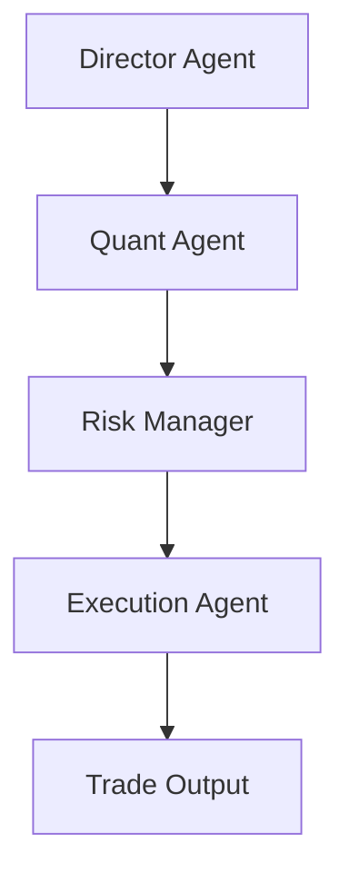

# AutoHedge

[](https://discord.gg/agora-999382051935506503) [](https://www.youtube.com/@kyegomez3242) [](https://www.linkedin.com/in/kye-g-38759a207/) [](https://x.com/kyegomezb)

[](https://badge.fury.io/py/autohedge)
[](https://opensource.org/licenses/MIT)
[](https://www.python.org/downloads/)
[](https://autohedge.readthedocs.io)
[](https://github.com/psf/black)

AutoHedge is an enterprise-grade autonomous agent hedge fund that trades on your behalf. It combines swarm intelligence and specialized AI agents to perform end-to-end market analysis, risk management, and execution with minimal human intervention.

**Current support:** Full autonomous trading on Solana. **Coming soon:** Coinbase and additional exchanges.

---

## Overview

AutoHedge is built to be the world's most powerful autonomous agent hedge fund. It runs continuous analysis, generates and validates trading theses, sizes risk, and executes orders across supported venues. The system is designed for institutional reliability: structured outputs, comprehensive logging, and a risk-first architecture that scales from single strategies to multi-venue, multi-asset deployment.

---

## Features

- **Multi-Agent Architecture**: Specialized agents for each stage of the trading pipeline
  - Director Agent: strategy and thesis generation
  - Quant Agent: technical and statistical analysis
  - Risk Management Agent: position sizing and risk assessment
  - Execution Agent: order generation and execution

- **Real-Time Market Analysis**: Integration with live market data for analysis and execution
- **Risk-First Design**: Built-in risk management and position sizing before any execution
- **Structured Output**: JSON-formatted recommendations and analysis for downstream systems
- **Enterprise Logging**: Detailed, configurable logging for audit and debugging
- **Extensible Framework**: Modular design for custom strategies and new venues

---

## Supported Venues

| Venue      | Status        | Notes                    |
|-----------|----------------|--------------------------|
| Solana    | Supported      | Full autonomous trading  |
| Coinbase  | Coming soon    | In development           |
| Other CEX | Roadmap        | Planned expansion        |

---

## Quick Start

### Installation

```bash
pip install -U autohedge
```

### Environment Variables

```bash
OPENAI_API_KEY=""
WORKSPACE_DIR="agent_workspace"
```

See `.env.example` for a full reference.

### Basic Usage

```python
from autohedge import AutoHedge

stocks = ["NVDA"]
trading_system = AutoHedge(stocks)

task = "Analyze NVIDIA for a 50k allocation and recommend action."
print(trading_system.run(task=task))
```

---

## Architecture

AutoHedge uses a multi-agent pipeline where each agent has a defined responsibility:



---

## Contributing

Contributions are welcome. See [Contributing Guidelines](CONTRIBUTING.md) for details.

1. Fork the repository
2. Create a feature branch (`git checkout -b feature/AmazingFeature`)
3. Commit changes (`git commit -m 'Add some AmazingFeature'`)
4. Push to the branch (`git push origin feature/AmazingFeature`)
5. Open a Pull Request

---

## License

MIT License. See [LICENSE](LICENSE) for details.

---

## Acknowledgments

- [Swarms](https://swarms.ai) for the AI agent framework
- [Tickr Agent](https://github.com/The-Swarm-Corporation/tickr-agent) for market data integration

---

## Support

- Issue Tracker: [GitHub Issues](https://github.com/The-Swarm-Corporation/AutoHedge/issues)
- Community: [Discord](https://swarms.ai)

---

AutoHedge by [The Swarm Corporation](https://github.com/The-Swarm-Corporation)
